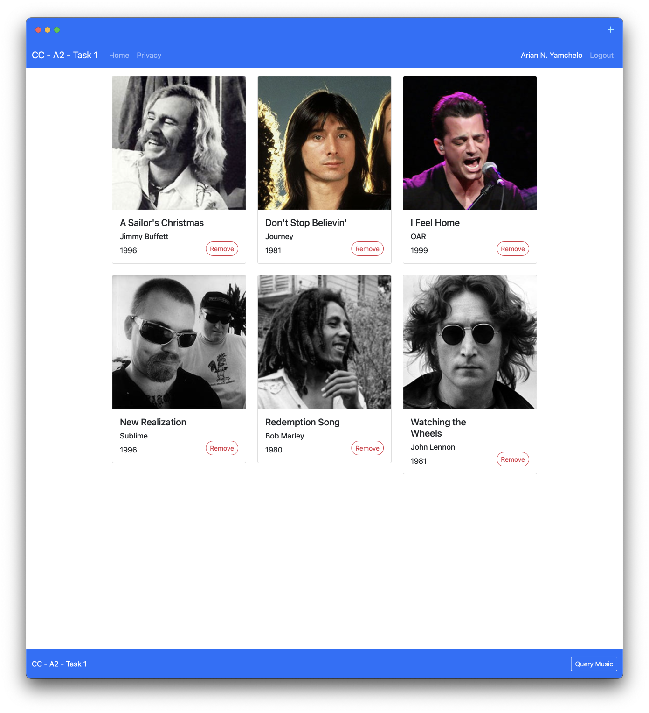
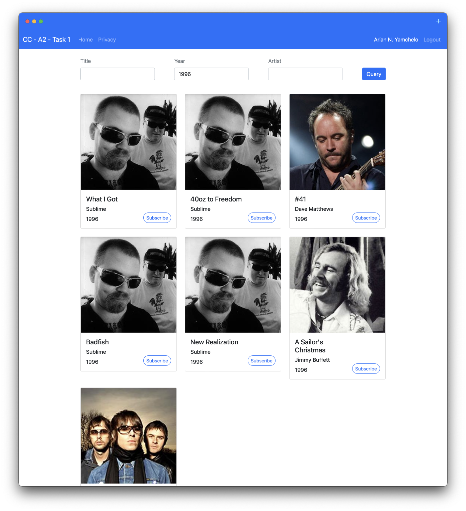

# cc-a2-task1

RMIT University - Academic Integrity Warning:
> "For serious breaches of academic integrity, students can be charged with academic misconduct. Possible penalties include **cancellation of results** and **expulsion resulting in the cancellation of a student's program**."
For more information visit [Academic Integrity at RMIT](https://www.rmit.edu.au/students/my-course/assessment-results/academic-integrity)

**Home page** screenshot

**Query page** screenshot

~~[Amazon AWS EC2 Public IPv4 DNS](http://ec2-3-26-185-82.ap-southeast-2.compute.amazonaws.com)~~

## References

[1] K. Huiyeon, "Step-by-step visual guide on deploying a Flask application on AWS EC2", Medium, 2022. [Online]. Available: https://medium.com/techfront/step-by-step-visual-guide-on-deploying-a-flask-application-on-aws-ec2-8e3e8b82c4f7. [Accessed: 07- Oct- 2022].

[2] harshsethi2000, "How to Install Python3 on AWS EC2? - GeeksforGeeks", GeeksforGeeks, 2022. [Online]. Available: https://www.geeksforgeeks.org/how-to-install-python3-on-aws-ec2/. [Accessed: 07- Oct- 2022].

[3] "How to Use Nano, the Linux Command Line Text Editor", linuxize, 2022. [Online]. Available: https://linuxize.com/post/how-to-use-nano-text-editor/. [Accessed: 07- Oct- 2022].

[4] B. Rhodes, "How to leave/exit/deactivate a Python virtualenv", Stack Overflow, 2022. [Online]. Available: https://stackoverflow.com/questions/990754/how-to-leave-exit-deactivate-a-python-virtualenv. [Accessed: 07- Oct- 2022].

[5] "Deploying a Django application to Elastic Beanstalk", docs.aws.amazon.com, 2022. [Online]. Available: https://docs.aws.amazon.com/elasticbeanstalk/latest/dg/create-deploy-python-django.html. [Accessed: 07- Oct- 2022].

[6] "Ubuntu Manpage: networkd-dispatcher - Dispatcher service for systemd-networkd connection status changes", Manpages.ubuntu.com, 2022. [Online]. Available: https://manpages.ubuntu.com/manpages/kinetic/man8/networkd-dispatcher.8.html. [Accessed: 07- Oct- 2022].

[7] R. Gupta, "How to deploy Python Django Project on AWS EC2 Ubuntu Server.", Medium, 2022. [Online]. Available: https://medium.com/nerd-for-tech/how-to-deploy-python-django-project-on-aws-ec2-ubuntu-server-5c484fdb8f8c. [Accessed: 07- Oct- 2022].

[8] "Error connecting to your instance: Connection timed out", docs.aws.amazon.com/, 2022. [Online]. Available: https://docs.aws.amazon.com/AWSEC2/latest/UserGuide/TroubleshootingInstancesConnecting.html#TroubleshootingInstancesConnectionTimeout. [Accessed: 07- Oct- 2022].

[9] "Associate a static public IP address with your EC2 instance", Amazon Web Services, Inc., 2022. [Online]. Available: https://aws.amazon.com/premiumsupport/knowledge-center/ec2-associate-static-public-ip/. [Accessed: 07- Oct- 2022].

[10] R. Chakrabarty, J. Rotenstein and R. Chakrabarty, "I cannot SSH to my Linux EC2 Instance from My IP suggested by AWS. It works if incoming rule is set to ::0", Stack Overflow, 2022. [Online]. Available: https://stackoverflow.com/questions/66650254/i-cannot-ssh-to-my-linux-ec2-instance-from-my-ip-suggested-by-aws-it-works-if-i. [Accessed: 07- Oct- 2022].

[11] "Amazon EC2 instance IP addressing", docs.aws.amazon.com/, 2022. [Online]. Available: https://docs.aws.amazon.com/AWSEC2/latest/UserGuide/using-instance-addressing.html#using-instance-addressing-common. [Accessed: 07- Oct- 2022].

[12] "Resolve "Connection refused" or "Connection timed out" Errors When Connecting to an EC2 Instance with SSH", Amazon Web Services, Inc., 2022. [Online]. Available: https://aws.amazon.com/premiumsupport/knowledge-center/ec2-linux-resolve-ssh-connection-errors/. [Accessed: 07- Oct- 2022].

[13] N. Hadiq, "Deploy a Flask app on AWS EC2", Medium, 2022. [Online]. Available: https://medium.com/innovation-incubator/deploy-a-flask-app-on-aws-ec2-d1d774c275a2. [Accessed: 07- Oct- 2022].

[14] "Templates — Flask Documentation (2.2.x)", Flask.palletsprojects.com, 2022. [Online]. Available: https://flask.palletsprojects.com/en/2.2.x/templating/#standard-filters. [Accessed: 19- Oct- 2022].

[15] "Flask-Session — Flask-Sessions 0.0.4 documentation", Flask-session.readthedocs.io, 2022. [Online]. Available: https://flask-session.readthedocs.io/en/latest/. [Accessed: 19- Oct- 2022].

[16] F. Florencio Garcia, "Flask Sessions, what are they for, how it works, what options I have to persist this data?", Medium, 2022. [Online]. Available: https://medium.com/thedevproject/flask-sessions-what-are-they-for-how-it-works-what-options-i-have-to-persist-this-data-4ca48a34d3. [Accessed: 19- Oct- 2022].

[17] "Create a DynamoDB table using an AWS SDK", docs.aws.amazon.com, 2022. [Online]. Available: https://docs.aws.amazon.com/amazondynamodb/latest/developerguide/example_dynamodb_CreateTable_section.html. [Accessed: 19- Oct- 2022].

[18] "How to create JSON File?", Codebeautify.org, 2022. [Online]. Available: https://codebeautify.org/blog/how-to-create-json-file/. [Accessed: 19- Oct- 2022].

[19] K. Chris, "CSS Vertical Align – How to Center a Div, Text, or an Image [Example Code]", freeCodeCamp.org, 2022. [Online]. Available: https://www.freecodecamp.org/news/css-vertical-align-how-to-center-a-div-text-or-an-image-example-code/. [Accessed: 19- Oct- 2022].

[20] a. Mark Otto, "Introduction", Getbootstrap.com, 2022. [Online]. Available: https://getbootstrap.com/docs/5.0/getting-started/introduction/. [Accessed: 19- Oct- 2022].

[21] "What is Python KeyError and How to Handle it with 3 Examples", A-Z Tech, 2022. [Online]. Available: https://www.jquery-az.com/python-keyerror-handle-3-examples/. [Accessed: 19- Oct- 2022].

[22] C. Hansen, "Python KeyError Exceptions and How to Handle Them – Real Python", Realpython.com, 2022. [Online]. Available: https://realpython.com/python-keyerror/. [Accessed: 19- Oct- 2022].

[23] S. S, "CRUD operations on DynamoDB with Flask APIs", Medium, 2022. [Online]. Available: https://medium.com/featurepreneur/crud-operations-on-dynamodb-with-flask-apis-916f6cae992. [Accessed: 19- Oct- 2022].

[24] B. Oakley and Blendouble, "NoneType' object has no attribute '__getitem__'", Stack Overflow, 2022. [Online]. Available: https://stackoverflow.com/questions/24119731/nonetype-object-has-no-attribute-getitem. [Accessed: 19- Oct- 2022].

[25] Laren-AWS, "aws-doc-sdk-examples/scenario_getting_started_movies.py at main · awsdocs/aws-doc-sdk-examples", GitHub, 2022. [Online]. Available: https://github.com/awsdocs/aws-doc-sdk-examples/blob/main/python/example_code/dynamodb/GettingStarted/scenario_getting_started_movies.py. [Accessed: 19- Oct- 2022].

[26] Tech With Tim, "Python Website Full Tutorial - Flask, Authentication, Databases & More", Youtube.com, 2022. [Online]. Available: https://www.youtube.com/watch?v=dam0GPOAvVI&t=7143s. [Accessed: 19- Oct- 2022].

[27] J. Rai, "Upload Files To S3 in Python using boto3 | Python Upload Files to S3 - TutorialsBuddy", Tutorialsbuddy.com, 2022. [Online]. Available: https://www.tutorialsbuddy.com/python-upload-file-to-s3. [Accessed: 19- Oct- 2022].

[28] J. Rotenstein, D. Richard and Z. Smith, "How to determine if an AWS s3 bucket has at least one public object?", Stack Overflow, 2022. [Online]. Available: https://stackoverflow.com/questions/61066179/how-to-determine-if-an-aws-s3-bucket-has-at-least-one-public-object. [Accessed: 19- Oct- 2022].

[29] ampersand, Quentin, ALFA and Lê Tư Thành, "How to query all rows of one column in DynamoDB?", Stack Overflow, 2022. [Online]. Available: https://stackoverflow.com/questions/54996861/how-to-query-all-rows-of-one-column-in-dynamodb. [Accessed: 19- Oct- 2022].

[30] B. Solomon and MP32, ""No connection adapters were found"", Stack Overflow, 2022. [Online]. Available: https://stackoverflow.com/questions/72192980/no-connection-adapters-were-found. [Accessed: 19- Oct- 2022].

[31] "presigned_url.py", docs.aws.amazon.com, 2022. [Online]. Available: https://docs.aws.amazon.com/code-samples/latest/catalog/python-s3-s3_basics-presigned_url.py.html. [Accessed: 19- Oct- 2022].

[32] "How to convert a dictionary to a string in Python? - AskPython", AskPython, 2022. [Online]. Available: https://www.askpython.com/python/string/dictionary-to-a-string. [Accessed: 19- Oct- 2022].

[33] dgh et al., "Upload image available at public URL to S3 using boto", Stack Overflow, 2022. [Online]. Available: https://stackoverflow.com/questions/14346065/upload-image-available-at-public-url-to-s3-using-boto?rq=1. [Accessed: 19- Oct- 2022].

[34] A. Yohan Malshika, "DynamoDB Filter Expressions (Ultimate Guide w/ Examples)", Dynobase.dev, 2022. [Online]. Available: https://dynobase.dev/dynamodb-filterexpression/. [Accessed: 19- Oct- 2022].

[35] P. Acsany, "Primer on Jinja Templating – Real Python", Realpython.com, 2022. [Online]. Available: https://realpython.com/primer-on-jinja-templating/. [Accessed: 19- Oct- 2022].

[36] "Write an item to a DynamoDB table", docs.aws.amazon.com, 2022. [Online]. Available: https://docs.aws.amazon.com/amazondynamodb/latest/developerguide/GettingStarted.WriteItem.html. [Accessed: 19- Oct- 2022].

[37] Laren-AWS, "aws-doc-sdk-examples/scenario_getting_started_movies.py at main · awsdocs/aws-doc-sdk-examples", GitHub, 2022. [Online]. Available: https://github.com/awsdocs/aws-doc-sdk-examples/blob/main/python/example_code/dynamodb/GettingStarted/scenario_getting_started_movies.py. [Accessed: 19- Oct- 2022].

[38] L. Stanley, R. Cowie, Никита Шишкин and gerardw, "Call a python function from jinja2", Stack Overflow, 2022. [Online]. Available: https://stackoverflow.com/questions/6036082/call-a-python-function-from-jinja2. [Accessed: 19- Oct- 2022].

[39] "QueryFilter", docs.aws.amazon.com, 2022. [Online]. Available: https://docs.aws.amazon.com/amazondynamodb/latest/developerguide/LegacyConditionalParameters.QueryFilter.html. [Accessed: 19- Oct- 2022].

[40] "Scan a DynamoDB table", docs.aws.amazon.com, 2022. [Online]. Available: https://docs.aws.amazon.com/amazondynamodb/latest/developerguide/GettingStarted.Scan.html. [Accessed: 19- Oct- 2022].

[41] "Python Switch Case with Examples", pythongeeks.org, 2022. [Online]. Available: https://pythongeeks.org/switch-in-python/. [Accessed: 19- Oct- 2022].

[42] T. Lathuille et al., "Dynamodb scan() using FilterExpression", Stack Overflow, 2022. [Online]. Available: https://stackoverflow.com/questions/44704443/dynamodb-scan-using-filterexpression. [Accessed: 19- Oct- 2022].

[43] "Query a DynamoDB table", docs.aws.amazon.com, 2022. [Online]. Available: https://docs.aws.amazon.com/amazondynamodb/latest/developerguide/GettingStarted.Query.html. [Accessed: 19- Oct- 2022].

[44] J. Astrahan, P. Sharma, D. Grinko, marc_s, Kevin Hooke and Eyal Ch, "How do I query DynamoDB with non primary key field?", Stack Overflow, 2022. [Online]. Available: https://stackoverflow.com/questions/47569793/how-do-i-query-dynamodb-with-non-primary-key-field. [Accessed: 19- Oct- 2022].

[45] How can I grant my Amazon EC2 instance access to an Amazon S3 bucket?, 20-Sep-2022. [Online]. Available: https://aws.amazon.com/premiumsupport/knowledge-center/ec2-instance-access-s3-bucket/. [Accessed: 20-Oct-2022]. 

[46] S. Engdahl, “Blogs,” Amazon, 2008. [Online]. Available: https://aws.amazon.com/blogs/security/writing-iam-policies-how-to-grant-access-to-an-amazon-s3-bucket/. [Accessed: 20-Oct-2022]. 

[47] J. Scharf, “Blogs,” Amazon, 06-May-2013. [Online]. Available: https://aws.amazon.com/blogs/security/writing-iam-policies-how-to-grant-access-to-an-amazon-s3-bucket/. [Accessed: 20-Oct-2022]. 
